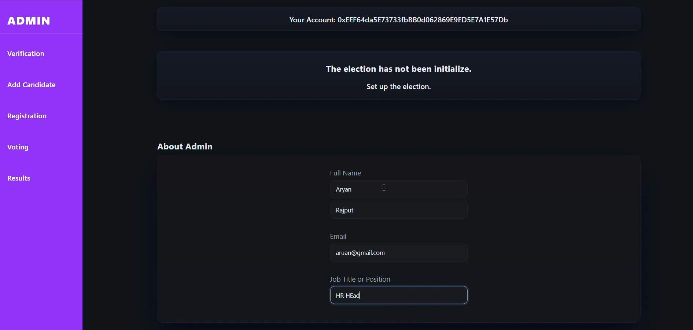
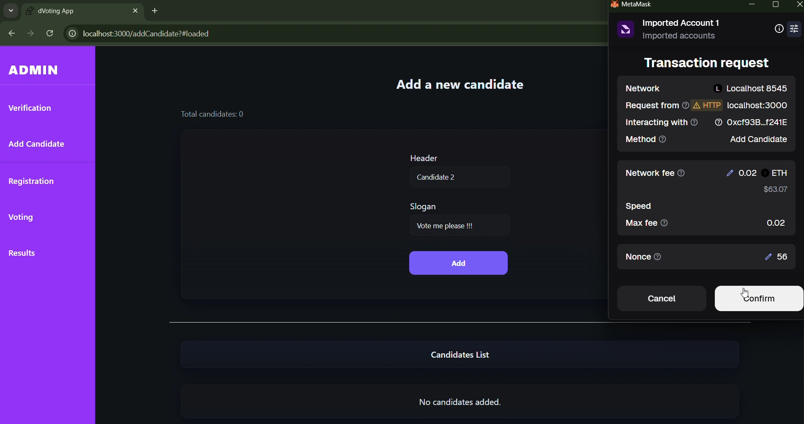
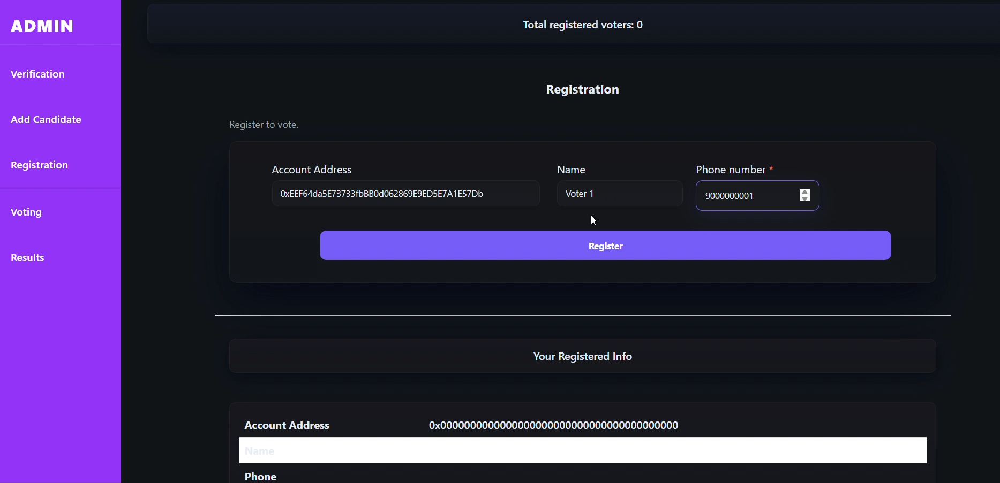
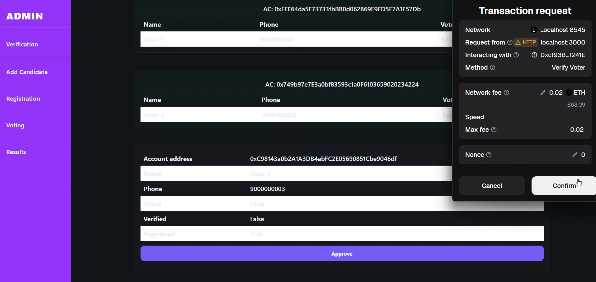
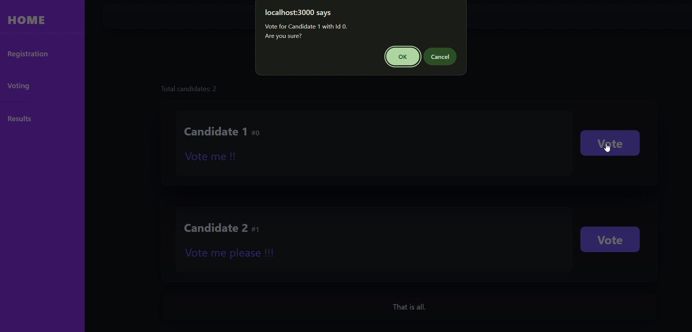
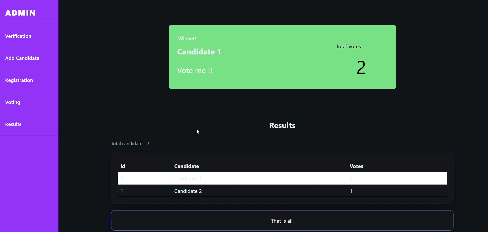

# 📌 VoteChain – Decentralised Voting System
*A Blockchain-Based Secure & Transparent Voting Application*

---

## 🚀 Overview
**VoteChain** is a decentralized voting system built on the **Ethereum blockchain** using **Solidity, Truffle, Ganache, React, Web3.js, and MetaMask**.  
The system eliminates centralized servers by storing all election data directly on the blockchain, ensuring **security, transparency, and immutability**.

## 🛠️ Tech Stack

### **Blockchain**
- Solidity  
- Ethereum / EVM  
- Truffle  
- Ganache  
- MetaMask  
- Web3.js  

### **Frontend**
- React.js  
- React Router  
- React Hook Form  
- CSS  

### **Tools**
- Node.js  
- npm  
- VS Code  

## ⚙️ Features

### 🔹 Admin Panel
- Set election details  
- Add candidates  
- View & verify voters  
- Start & end election  

### 🔹 Voter Functions
- Register using MetaMask  
- Get verified by admin  
- Cast one secure vote  
- View results after election ends  

### 🔹 Blockchain Guarantees
- Tamper-proof voting  
- No double voting  
- Fully transparent vote count  
- Immutable data stored on-chain  

---

## 🧩 Smart Contract Capabilities
- Candidate management  
- Voter registration & verification  
- Voting logic  
- Election start/end control  
- Result generation  

Smart contract stores:  
`candidateDetails`, `voterDetails`, `voters[]`, `voteCount`, `start/end flags`

---

## 📂 Project Structure
